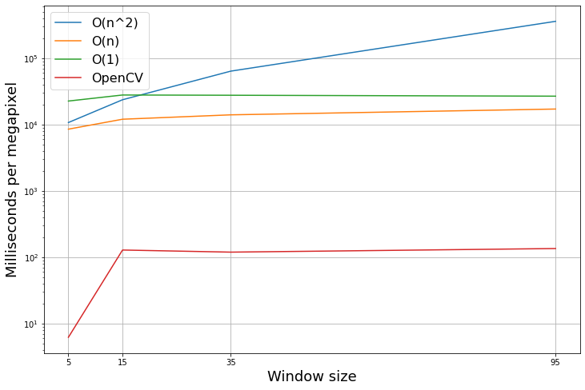

# Median filtering homework
## Overview
In this homework variations of median filtering algorithm were realised.
## Results
|  |  |
|:-------------------------------------------------------------:| ---------------------------------------------------------------------- |
|               
*Original image*
               | 
*Window size 5 filtering*
                             |
|                                                               |                                                                        |

|  |  |
|:-----------------------------------------------------------------------:| ----------------------------------------------------------------------- |
|                    
*Window size 15 filtering*
                    | 
*Window size 35 filtering*
                              |
|                                                                         |                                                                         |
## Complexity analysis
Having current image position $(i,j)$ we need to find a median brightness value for each color (red, green, blue) in a window $[i - n,\ i + n]\times[j - n,\ j + n]$ where $n$ is a window size.
### Trivial $O(n^2)$ algorithm
Going through the full window takes $3n^2$ operations for pixel to fill each color's histogram and $3\times256=768$ operations in worst case to retrieve medians from them. Having an image with size $M\times N$ the final time complexity is $768\times 3n^2\times M\times N=O(n^2)$.  
We need 3 arrays to keep histograms with 256 bins. So, the space complexity is $3\times 256=768=O(1)$.
### Huang's $O(n)$ algorithm
Each time we move to the next column we add the rightmost values to the current window histogram and substract the rightmost column of previous window. We need $255\times 3\times n=768\times n$ operations to add and substract values in histogram for each pixel. So, the final time complexity is $768\times n\times M\times N=O(n)$.  
As well as in the previous algorithm we need $3\times 256=768=O(1)$ extra space to keep track of current histograms.
### Perreault's $O(1)$ algorithm
The idea is the same as in the Huang's algorithm but we save histograms for all $N$ columns and update them then moving to the next row. We need $2\times 3\times M\times N=6\times M\times N$ operations to update histograms and $3\times 256=768$ operations in worst case to retrieve median. The total time complexity is $6\times M + 768\times M\times N=O(1)$.  
We need to keep track of histograms for each color in addition to current histograrm. So, it's $3\times 255\times M + 3\times 255 = 768(M+1)=O(1)$ extra space.
## Algorithms comparison
Performance of the algorithms was checked and compared with OpenCV realisation on $4176\times 2073$ image with $5,\, 15,\, 35,\, 95$ window sizes.

It's obvious that OpenCV uses $O(1)$ median filtering realization with operations vectorization.
## Optimal parameters
As we can see, $O(n)$ realization is better for all window sizes to 95. Let's consider the equation:
<!-- $$
    768nMN=6M + 768MN \Leftrightarrow n=\dfrac{1}{128N}
$$ -->