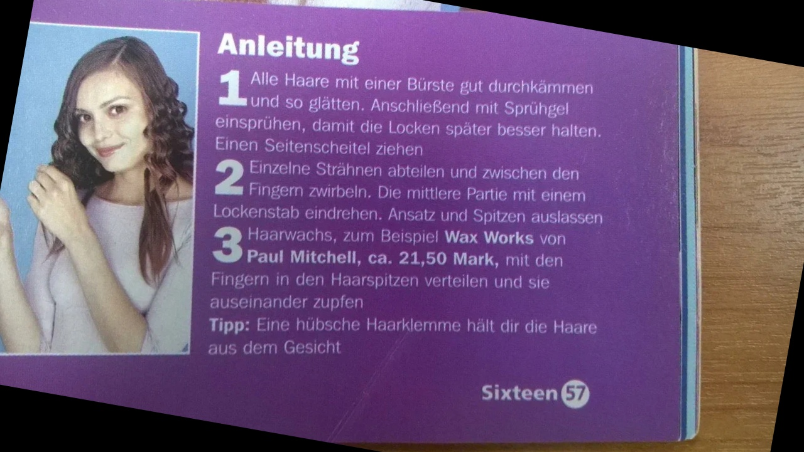

# Fast Hough Transform

## Pipeline
Firstly, we extract the edges of image by Sobel filter with $9\times 9$ kernel size and $0.9$-percentile threshold for values.  
|        |      |
|:-------------------------------------------------------------:| :--------------------------------------------------------------------:        |
|                                *Original image*               |                  *Sobel filtering intermediate result*                        |
  
  
Secondly, we use Fast Hough Transform to get a heatmap in parameters space and find an angle with largest value. After that we need to normalize this angle
by $45$ degrees and rotate the image using one of the interpolation algorithms (bilinear or nearest neighbor).

## Results
|        |            |
|:-------------------------------------------------------------:| :--------------------------------------------------------------------:        |
|                                *Original image*               |                  *Bilinear approximation result*                              |
|                                                               |                                                                               |

|  |                      |
|:-----------------------------------------------------------------------:| :---------------------------------------------------------------------: |
|                            *Original image*                             |         *Bilinear approximation result*                                 |
|                                                                         |                                                                         |

|        |             |
|:-------------------------------------------------------------:| :--------------------------------------------------------------------:        |
|                                *Original image*               |                  *Nearest neighbour approximation result*                     |
|                                                               |                                                                               |

|  |                        |
|:-----------------------------------------------------------------------:| :---------------------------------------------------------------------: |
|                            *Original image*                             |         *Nearest neighbour approximation result*                        |
|                                                                         |                                                                         |
