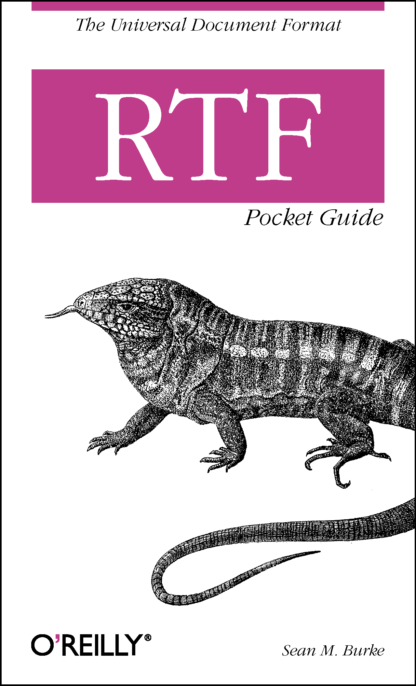
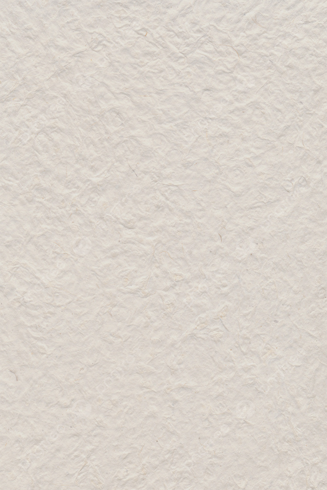
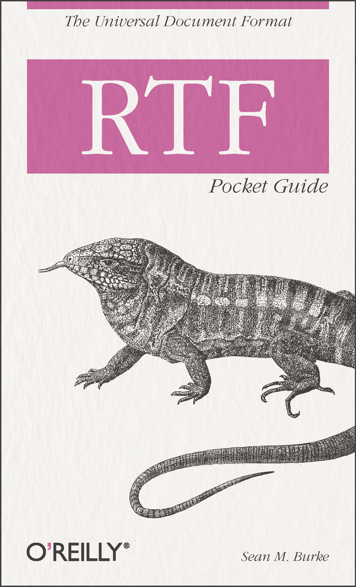
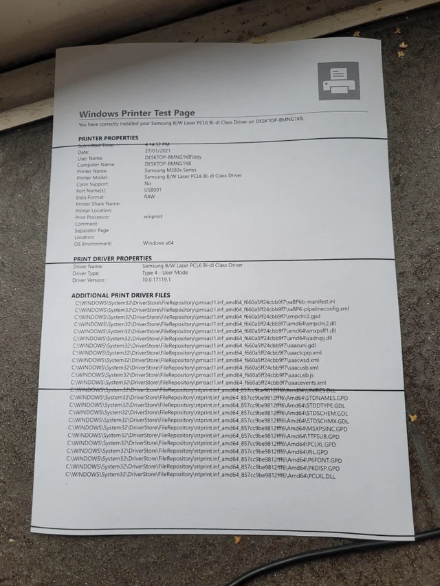
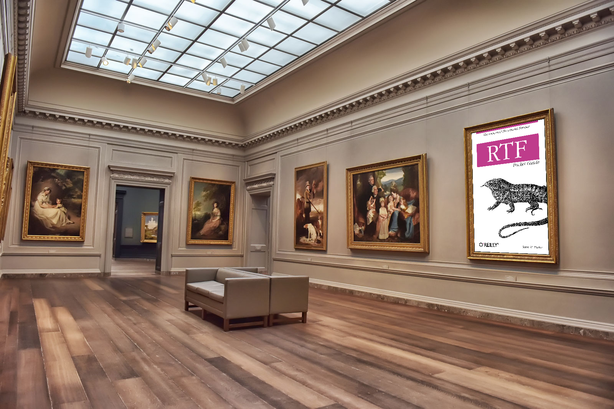
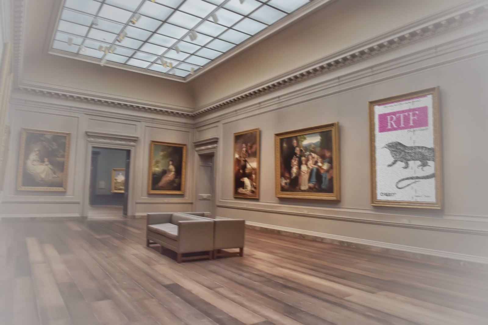

## Images augmentations

Objective of this task is to provide augmentations for the set of perfectly rendered papers. Papers have to be put on some surfaces with further addition of camera and printing defects.

## Methodolohy
I split pipeline of augmentation into three four parts: texture addition, printing defects, paper placing, camera defects.

### Texture addition
Here, having an image of paper and an image of paper texture, I blend them together.

|  |  |  |
| :-----------------------------------------------------------------: | :-------------------------------------------------------------------: | :------------------------------------------------------------------: |
|                            *Paper image*                            |                            *Texture image*                            |                           *Blending image*                           |
|                                                                     |                                                                       |                                                                      |

### Printing defects
I add some vertical lines to imitate printing defects.

|  |
| :----------------------------------------------------------------------------: |
|                         *Example of printing defects*                          |
|                                                                                |

### Paper placing
Now, it's time to place our paper image into background's surface. Here I use perspective transformation to get paper image coordinates in background image and blend transformed paper image and a background

|  |  |  |
| :-----------------------------------------------------------------: | :--------------------------------------------------------------------------: | :------------------------------------------------------------------: |
|                            *Paper image*                            |                              *Background image*                              |                            *Result image*                            |
|                                                                     |                                                                              |                                                                      |

### Camera defects
Here I add Vignette filter and movement blur.

|  |
| :----------------------------------------------------------------------------: |
|                         *Final result*                          |
|                                                                                |

