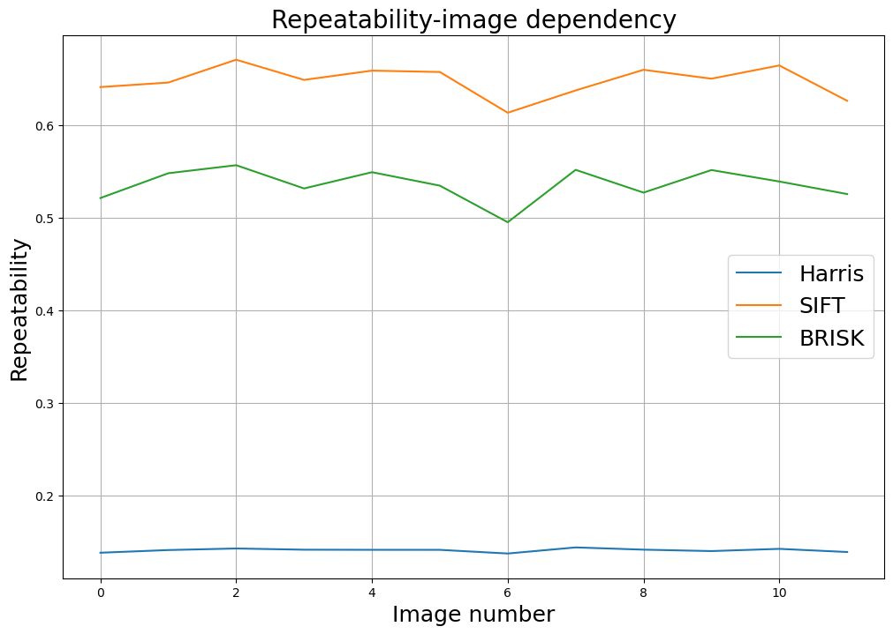

## Detectors and specials points descriptors

### Methodology
In this homework three special points detectors were compared by the _repeatability_ metric. _Repeatability_ is the averaged ratio of photos where concrete special point is detected.

### Experiments

#### Speed
| Detector | Speed (seconds) |
|--------|---------------|
| Harris | $6.9\cdot 10^{-5}$ |
| SIFT   | $6.9\cdot 10^{-4}$   |
| BRISK  | $8.1\cdot 10^{-4}$   |

#### Repeatability

### Conclusions

Harris detector is the fastest one but it has much lower repeatability then SIFT and BRISK. SIFT is faster than BRISK and has the highest repeatability.
